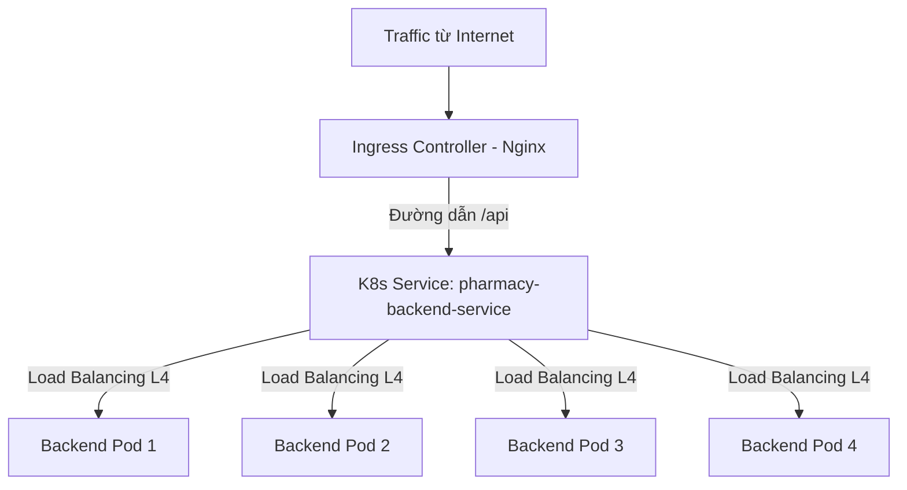
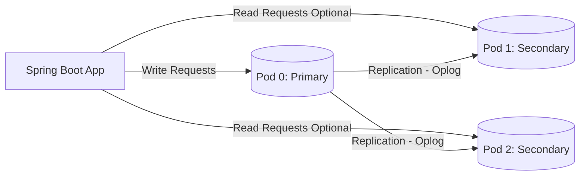

# HƯỚNG DẪN KIẾN TRÚC & TRIỂN KHAI KUBERNETES (K8S) CHO DỰ ÁN PHARMACY

Tài liệu này được biên soạn bởi Software Architect nhằm hướng dẫn chuyển đổi hệ thống của dự án Pharmacy từ Docker Compose hiện tại sang Kubernetes (K8s) để đáp ứng các yêu cầu về khả năng chịu lỗi, tự động cân bằng tải và tự động mở rộng.

---

## PHẦN 1: TỔNG QUAN & LÝ THUYẾT NỀN TẢNG

### 1. Kubernetes (K8s) là gì?
**Kubernetes (K8s)** là một nền tảng mã nguồn mở dùng để tự động hóa việc điều phối, quản lý, mở rộng và triển khai các ứng dụng đã được container hóa (Docker).

Trong kiến trúc hệ thống hiện đại, K8s đóng vai trò là một **Nhạc trưởng (Conductor)** điều phối toàn bộ các container (Pods) hoạt động đồng bộ:
* **Quản lý trạng thái mong muốn (Desired State Management):** Đảm bảo số lượng container thực tế luôn khớp với số lượng khai báo.
* **Đồng bộ hóa tài nguyên:** Tự động phân bổ CPU/RAM từ cụm máy chủ vật lý cho các container một cách tối ưu.

### 2. K8s giải quyết những bài toán cốt lõi nào của kiến trúc truyền thống?
So với việc quản lý ứng dụng thủ công hoặc sử dụng Docker đơn lẻ, K8s tự động hóa các tác vụ phức tạp:

* **Tự phục hồi (Self-healing):** Tự động khởi động lại các container bị sập, thay thế và lên lịch lại khi một Node vật lý bị lỗi.
* **Cân bằng tải & Phát hiện dịch vụ (Service Discovery & Load Balancing):** K8s tự động gán địa chỉ IP và tên miền nội bộ cho các container, tự động phân phối lưu lượng truy cập qua cơ chế Load Balancing nội bộ.
* **Cập nhật không gián đoạn (Zero-downtime Rolling Update):** Cập nhật mã nguồn mới bằng cách khởi động container mới trước, kiểm tra sức khỏe rồi mới tắt container cũ.
* **Quản lý cấu hình tập trung:** Tách biệt mã nguồn và cấu hình môi trường thông qua `ConfigMap` và `Secret`.

### 3. Ưu điểm và nhược điểm lớn nhất của K8s

#### Ưu điểm:
* **Mở rộng dễ dàng (Scalability):** Scale-up hoặc scale-down hệ thống trong vài giây.
* **Đa nền tảng (Cloud Agnostic):** Có thể chạy mượt mà trên AWS (EKS), GCP (GKE), Azure (AKS) hoặc hạ tầng vật lý tại chỗ (On-Premise).
* **Cộng đồng lớn mạnh:** Hệ sinh thái CNCF phong phú với hàng loạt công cụ bổ trợ.

#### Nhược điểm:
* **Độ phức tạp cực cao (High Complexity):** Đòi hỏi kỹ năng vận hành chuyên sâu về mạng (networking) và lưu trữ dữ liệu (storage).
* **Tốn tài nguyên khởi tạo (Overhead):** Các dịch vụ điều khiển (Control Plane) của K8s tiêu thụ lượng RAM/CPU đáng kể ngay cả khi chưa chạy ứng dụng.
* **Debug khó khăn:** Khó theo dõi lỗi do traffic đi qua nhiều lớp trừu tượng hóa của mạng.

### 4. Tại sao phải sử dụng K8s? Các giải pháp thay thế (Alternatives)
Chỉ nên áp dụng K8s khi hệ thống của bạn có quy mô lớn, nhiều microservices, lưu lượng truy cập biến động mạnh và yêu cầu tính sẵn sàng cực cao ($99.99\%$).

Nếu dự án của bạn ở mức độ vừa và nhỏ, hãy xem xét các giải pháp thay thế đơn giản hơn:
* **Docker Swarm:** Tích hợp sẵn trong Docker, cấu hình dễ dàng thông qua cú pháp tương tự Docker Compose. Rất phù hợp cho các team nhỏ tự vận hành.
* **AWS ECS / GCP Cloud Run (Serverless Container):** Chạy ứng dụng container hóa không cần quản lý hạ tầng máy chủ, hệ thống tự động scale và cân bằng tải.
* **PaaS (Render, Railway, Heroku):** Đơn giản hóa tối đa quy trình triển khai, chỉ cần kết nối với repository GitHub.

---

## PHẦN 2: BÀI TOÁN THỰC TẾ CHO DỰ ÁN PHARMACY

Dựa trên cấu trúc hiện tại của dự án bao gồm: **Frontend** (React/Next.js), **Backend** (Spring Boot) kết nối tới **MongoDB** (định nghĩa tại [docker-compose.yml](file:///d:/pharmacy-project_/docker-compose.yml)), dưới đây là thiết kế kiến trúc K8s chi tiết.

### 1. Phân tích bài toán thực tế K8s giải quyết trong dự án Pharmacy
* **Scale-up Backend:** Khi lượng khách hàng truy cập tìm kiếm và mua thuốc tăng đột biến, hệ thống tự động nhân bản Spring Boot API để tránh quá tải.
* **Zero-downtime:** Khi deploy phiên bản mới của website hoặc API, quầy thuốc vẫn hoạt động trực tuyến bình thường mà không bị gián đoạn giây nào.
* **Độc lập hạ tầng:** Cho phép cô lập database MongoDB vào vùng mạng an toàn phía sau, chỉ cho phép Backend Spring Boot kết nối trực tiếp.

### 2. Cấu hình Load Balancing chia đều traffic cho 4 thực thể backend
Để phân phối tải đều cho 4 thực thể backend chạy song song, K8s sử dụng đối tượng **Service** đóng vai trò là Layer 4 Load Balancer:



* **Deployment** định nghĩa cấu hình chạy ứng dụng Spring Boot với tham số `replicas: 4`.
* **Service** (ClusterIP) đại diện cho một IP ảo cố định. Khi Client gọi tới IP này, kube-proxy trên các node vật lý sẽ tự động chuyển tiếp request tới một trong 4 Pods dựa trên thuật toán cân bằng tải ngẫu nhiên hoặc xoay vòng.

### 3. Cơ chế hoạt động của Tự động mở rộng (Auto-scaling)
Hệ thống K8s tự động co giãn thông qua **Horizontal Pod Autoscaler (HPA)**:
1. **Thu thập dữ liệu:** `Metrics Server` liên tục đo lượng CPU/RAM tiêu thụ của các Pod.
2. **Ra quyết định:** HPA kiểm tra chu kỳ (mặc định 15 giây). Nếu lượng CPU trung bình của 4 Pod vượt quá ngưỡng quy định (ví dụ $70\%$), HPA ra lệnh cho Deployment tạo thêm các Pod mới.
3. **Cập nhật định tuyến:** Ngay khi Pod mới ở trạng thái `Ready`, K8s Service sẽ tự động thêm IP của Pod mới vào danh sách cân bằng tải để chia sẻ lưu lượng ngay lập tức.
4. **Scale-down:** Khi tải giảm xuống dưới ngưỡng mục tiêu trong một khoảng thời gian nhất định (mặc định sau 5 phút nhàn rỗi), HPA sẽ tự động giảm số lượng Pod về mức tối thiểu để tiết kiệm tài nguyên.

### 4. File cấu hình mẫu (Kubernetes Manifests)

#### 4.1 Backend Deployment & Load Balancing (`backend-deployment.yaml`)
```yaml
apiVersion: apps/v1
kind: Deployment
metadata:
  name: pharmacy-backend
  labels:
    app: pharmacy-backend
spec:
  replicas: 4 # Đảm bảo chạy 4 server ứng dụng backend
  selector:
    matchLabels:
      app: pharmacy-backend
  template:
    metadata:
      labels:
        app: pharmacy-backend
    spec:
      containers:
      - name: backend-container
        image: dinhsi1401/pharmacy:latest
        imagePullPolicy: Always
        ports:
        - containerPort: 8080
        resources: # Định nghĩa giới hạn tài nguyên để HPA hoạt động chính xác
          limits:
            cpu: "1000m"
            memory: "1Gi"
          requests:
            cpu: "250m"
            memory: "512Mi"
        env:
        - name: MONGODB_URI
          value: "mongodb://pharmacy-mongo-0.pharmacy-mongo-headless:27017,pharmacy-mongo-1.pharmacy-mongo-headless:27017,pharmacy-mongo-2.pharmacy-mongo-headless:27017/?replicaSet=rs0"
        - name: MONGODB_DATABASE
          value: "pharmacy"
        livenessProbe:
          httpGet:
            path: /actuator/health/liveness
            port: 8080
          initialDelaySeconds: 30
          periodSeconds: 10
        readinessProbe:
          httpGet:
            path: /actuator/health/readiness
            port: 8080
          initialDelaySeconds: 30
          periodSeconds: 10
---
apiVersion: v1
kind: Service
metadata:
  name: pharmacy-backend-service
spec:
  selector:
    app: pharmacy-backend
  ports:
    - protocol: TCP
      port: 8080
      targetPort: 8080
  type: ClusterIP
```

#### 4.2 Cấu hình Tự động co giãn cho Backend (`backend-hpa.yaml`)
```yaml
apiVersion: autoscaling/v2
kind: HorizontalPodAutoscaler
metadata:
  name: pharmacy-backend-hpa
spec:
  scaleTargetRef:
    apiVersion: apps/v1
    kind: Deployment
    name: pharmacy-backend
  minReplicas: 2   # Co lại tối thiểu 2 Pod khi rảnh
  maxReplicas: 10  # Giãn tối đa 10 Pod khi chịu tải nặng
  metrics:
  - type: Resource
    resource:
      name: cpu
      target:
        type: Utilization
        averageUtilization: 70 # Tự động scale khi CPU trung bình vượt quá 70%
```

#### 4.3 Frontend Deployment & Service (`frontend-deployment.yaml`)
```yaml
apiVersion: apps/v1
kind: Deployment
metadata:
  name: pharmacy-frontend
  labels:
    app: pharmacy-frontend
spec:
  replicas: 2
  selector:
    matchLabels:
      app: pharmacy-frontend
  template:
    metadata:
      labels:
        app: pharmacy-frontend
    spec:
      containers:
      - name: frontend-container
        image: vokhoaecho/pharmacy-frontend:latest
        ports:
        - containerPort: 3000
        resources:
          limits:
            cpu: "500m"
            memory: "512Mi"
          requests:
            cpu: "100m"
            memory: "256Mi"
---
apiVersion: v1
kind: Service
metadata:
  name: pharmacy-frontend-service
spec:
  selector:
    app: pharmacy-frontend
  ports:
    - protocol: TCP
      port: 80
      targetPort: 3000
  type: ClusterIP
```

---

## 5. Thiết kế kiến trúc Database (MongoDB) chịu lỗi và toàn vẹn dữ liệu

Để lưu trữ MongoDB trên K8s mà không sợ mất dữ liệu khi container khởi động lại, ta sử dụng **StatefulSet** kết hợp với **Replica Set (3 Nodes)**.

### Kiến trúc Replica Set trong K8s:
* **1 Node Primary:** Đảm nhận nhiệm vụ nhận request Ghi (Write) từ Spring Boot backend.
* **2 Node Secondary:** Sao chép dữ liệu liên tục từ Primary thông qua Oplog để dự phòng và hỗ trợ các truy vấn Đọc (Read) nếu cần.
* **Headless Service:** K8s cung cấp một dịch vụ không có IP đại diện nhằm gán định danh DNS tĩnh cho từng Node: `pharmacy-mongo-0.pharmacy-mongo-headless`, `pharmacy-mongo-1.pharmacy-mongo-headless`,...



### Manifest triển khai MongoDB StatefulSet (`mongodb-statefulset.yaml`)
```yaml
apiVersion: v1
kind: Service
metadata:
  name: pharmacy-mongo-headless
  labels:
    app: pharmacy-mongo
spec:
  ports:
  - port: 27017
    name: mongodb
  clusterIP: None
  selector:
    app: pharmacy-mongo
---
apiVersion: apps/v1
kind: StatefulSet
metadata:
  name: pharmacy-mongo
spec:
  serviceName: "pharmacy-mongo-headless"
  replicas: 3 # Cụm 3 Nodes
  selector:
    matchLabels:
      app: pharmacy-mongo
  template:
    metadata:
      labels:
        app: pharmacy-mongo
    spec:
      terminationGracePeriodSeconds: 30
      containers:
      - name: mongodb
        image: mongo:8.0
        command:
        - "mongod"
        - "--replSet"
        - "rs0"
        - "--bind_ip_all"
        ports:
        - containerPort: 27017
          name: mongodb
        volumeMounts:
        - name: mongo-data
          mountPath: /data/db
        resources:
          limits:
            cpu: "2000m"
            memory: "2Gi"
          requests:
            cpu: "500m"
            memory: "1Gi"
  volumeClaimTemplates: # Tự động yêu cầu cấp ổ đĩa cứng vật lý riêng biệt cho từng Pod
  - metadata:
      name: mongo-data
    spec:
      accessModes: [ "ReadWriteOnce" ]
      resources:
        requests:
          storage: 10Gi
```

### Cách kích hoạt cụm Replica Set thủ công:
Sau khi các Pod MongoDB khởi chạy thành công, truy cập vào Pod đầu tiên và cấu hình:
```bash
# Truy cập vào shell của Pod
kubectl exec -it pharmacy-mongo-0 -- mongosh

# Chạy lệnh khởi tạo kết nối 3 nodes
rs.initiate({
  _id: "rs0",
  members: [
    { _id: 0, host: "pharmacy-mongo-0.pharmacy-mongo-headless.default.svc.cluster.local:27017" },
    { _id: 1, host: "pharmacy-mongo-1.pharmacy-mongo-headless.default.svc.cluster.local:27017" },
    { _id: 2, host: "pharmacy-mongo-2.pharmacy-mongo-headless.default.svc.cluster.local:27017" }
  ]
})
```

### Khuyến nghị cho Production:
Trong môi trường thực tế doanh nghiệp, việc tự viết StatefulSet cho Database khá rủi ro và tốn công vận hành. **Best practice** là sử dụng **MongoDB Community Operator**. Operator này là một agent chạy ngầm trong K8s, tự động hóa các thao tác nâng cấp phiên bản, sao lưu (backup) dữ liệu định kỳ và xử lý sự cố tự động mà không cần can thiệp thủ công.
