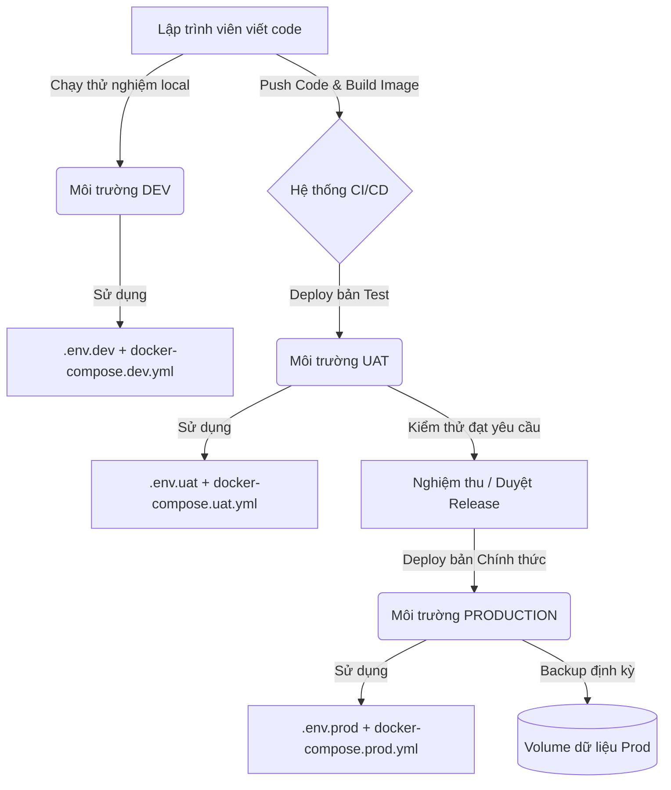

# So Sánh Và Hướng Dẫn Vận Hành 3 Môi Trường: Dev, UAT, Production Bằng Docker Compose

Quy trình phát triển phần mềm hiện đại đòi hỏi một ứng dụng phải đi qua các môi trường khác nhau trước khi tiếp cận người dùng cuối. Tài liệu này phân tích chi tiết sự khác biệt giữa 3 môi trường **Dev (Development)**, **UAT (User Acceptance Testing / Staging)**, và **Production (Prod)**, đồng thời hướng dẫn thiết lập Docker Compose tối ưu cho từng môi trường.

---

## 1. Sự Khác Biệt Giữa 3 Môi Trường: Dev, UAT và Production

| Tiêu chí | Môi trường Dev (Development) | Môi trường UAT (Testing / Staging) | Môi trường Production (Prod) |
| :--- | :--- | :--- | :--- |
| **Mục đích** | Phục vụ lập trình viên viết code, sửa lỗi, và tích hợp tính năng mới nhanh chóng. | Phục vụ QA/QC, Product Owner và khách hàng kiểm thử, nghiệm thu tính năng. | Cung cấp dịch vụ thực tế, ổn định cho người dùng cuối (End-users). |
| **Đặc tính ứng dụng** | - Bật chế độ Hot-reload / Live-reload.<br>- Bật Debug logs (verbose). | - Tắt Hot-reload.<br>- Chạy ứng dụng dưới dạng Build production để kiểm thử hiệu năng. | - Tắt hoàn toàn Debug/Hot-reload.<br>- Tối ưu hóa bộ nhớ, cache và nén tài nguyên. |
| **Hiệu năng & Tài nguyên** | Tối thiểu (chỉ cần chạy được trên máy cá nhân). Không giới hạn CPU/RAM trong container. | Trung bình. Giới hạn tài nguyên ở mức vừa phải để giả lập tải hệ thống thực tế. | Tối đa và ổn định. Giới hạn tài nguyên chặt chẽ cho từng container để tránh sập chéo. |
| **An toàn & Bảo mật** | - Mở port dịch vụ ra bên ngoài (Database, Backend) để debug.<br>- Sử dụng mật khẩu đơn giản (`root`/`root`). | - Đóng các port DB/Backend.<br>- Chỉ mở port Frontend.<br>- Giới hạn truy cập qua VPN hoặc Basic Auth. | - Bảo mật tối đa. Đóng hoàn toàn port DB.<br>- Truy cập HTTPS qua Reverse Proxy (Nginx/Traefik).<br>- Bảo mật mật khẩu thông qua Secret Key Vault. |
| **Dữ liệu (Database)** | Dữ liệu mẫu (Mock data/Fake data) được sinh tự động hoặc import nhanh. | Dữ liệu giả lập thực tế (Anonymized data - dữ liệu thật đã được mã hóa/ẩn danh). | Dữ liệu thật, nhạy cảm của khách hàng. Phải có cơ chế Backup tự động hàng ngày. |
| **Độ ổn định (High Availability)** | Thấp. Container crash có thể tự khởi chạy lại bằng tay. | Trung bình. Yêu cầu tự động khởi chạy lại nếu lỗi nhẹ (`restart: unless-stopped`). | Cao nhất. Tự phục hồi lỗi (`restart: always`), cấu hình Cluster/Replica (nếu cần). |
| **Hệ thống Log** | Log in trực tiếp ra console của container hoặc file cục bộ đơn giản. | Log lưu file xoay vòng, có thể tích hợp công cụ theo dõi logs tập trung. | Log xoay vòng chặt chẽ (giới hạn dung lượng). Đẩy logs về hệ thống tập trung (ELK, Grafana Loki). |

---

## 2. So Sánh Danh Sách File Giữa Các Môi Trường

Để đảm bảo nguyên lý **DRY (Don't Repeat Yourself)** và quản lý mã nguồn hiệu quả, cấu trúc thư mục được chia làm hai loại file chính: **File giống nhau** (được chia sẻ qua Git) và **File khác nhau** (cấu hình đặc thù cho từng môi trường).

### 2.1. Các File Giống Nhau (Được lưu trong Git và giống nhau ở mọi môi trường)
*   **Mã nguồn dịch vụ**: Các thư mục `backend/` và `frontend/` chứa code ứng dụng.
*   **Dockerfiles**:
    *   [backend/Dockerfile](file:///d:/pharmacy-project_/backend/Dockerfile): Dùng để build image Spring Boot chung.
    *   [frontend/Dockerfile](file:///d:/pharmacy-project_/frontend/Dockerfile): Dùng để build image React/Vite/HTML chung.
*   **Docker Compose Base**:
    *   [docker-compose.yml](file:///d:/pharmacy-project_/docker-compose.yml): File định nghĩa khung dịch vụ (services), quan hệ phụ thuộc (`depends_on`), mạng nội bộ (`networks`), và các volume mặc định.
*   **File Template biến môi trường**:
    *   [.env.example](file:///d:/pharmacy-project_/.env.example): Khai báo danh sách các biến môi trường cần thiết để chạy dự án nhưng không điền giá trị thật.
*   **Script vận hành**: Các file script cài đặt/khởi động như `import_db.sh`.

### 2.2. Các File Khác Nhau (Cấu hình riêng hoặc sinh ra độc lập ở từng môi trường)
*   **File biến môi trường thật (`.env`)**:
    *   `Dev`: Sử dụng `.env.dev` (chứa các thông số DB local, port chạy thử).
    *   `UAT`: Sử dụng `.env.uat` (chứa tài khoản kết nối DB test riêng, API endpoint của server test).
    *   `Prod`: Sử dụng `.env.prod` (chứa mật khẩu mạnh, API Key thật, domain production).
    *   *Lưu ý*: Các file này tuyệt đối **không commit** lên Git (ngoại trừ môi trường dev không nhạy cảm).
*   **File Docker Compose Override**:
    *   [docker-compose.dev.yml](file:///d:/pharmacy-project_/docker-compose.dev.yml): Chứa cấu hình map port DB ra ngoài, bật debug.
    *   `docker-compose.uat.yml`: Chứa cấu hình UAT (không mở port DB, giới hạn RAM/CPU nhẹ).
    *   [docker-compose.prod.yml](file:///d:/pharmacy-project_/docker-compose.prod.yml): Chứa cấu hình Prod (không mở port DB, giới hạn tài nguyên nghiêm ngặt, cấu hình Nginx SSL).
*   **Cấu hình Web Server & SSL**:
    *   `Dev`: Nginx đơn giản, không SSL hoặc SSL self-signed.
    *   `UAT`: Nginx cấu hình SSL miễn phí (Let's Encrypt).
    *   `Prod`: Nginx cấu hình SSL mua ngoài (Wildcard SSL), tối ưu hóa gzip, bảo mật header.
*   **Volume Dữ Liệu**:
    *   `Dev`: Thư mục mount cục bộ trên máy lập trình viên (Bind Mount).
    *   `UAT` & `Prod`: Sử dụng Docker Named Volume được cấu hình trỏ tới ổ SSD độc lập trên máy chủ hoặc SAN/NAS chuyên dụng.

---

## 3. Cấu Hồn Volume Và Database (DB) Ở Từng Môi Trường

### 3.1. Môi trường Development (Dev)
*   **Cấu hình Database**:
    *   **Expose Port**: Map port `27017:27017` để lập trình viên sử dụng các công cụ như MongoDB Compass, Robo 3T, DbSchema trực tiếp từ máy cá nhân kết nối vào Database chạy trong Docker.
    *   **Tài nguyên**: Không cấu hình giới hạn (limits). DB có thể sử dụng tối đa tài nguyên máy để xử lý nhanh các tác vụ phát triển.
    *   **Chính sách khởi động**: Thường để mặc định hoặc không cần thiết lập tự động khởi động liên tục để tránh tốn tài nguyên máy cá nhân khi không làm việc.
*   **Cấu hình Volume**:
    *   Sử dụng **Named Volume** đơn giản (`mongo-data:/data/db`) hoặc **Bind Mount** (`- ./data/db:/data/db`) để lập trình viên có thể dễ dàng xóa sạch dữ liệu test cũ để reset DB về trạng thái ban đầu khi cần.

### 3.2. Môi trường UAT (Testing / Staging)
*   **Cấu hình Database**:
    *   **Expose Port**: **Tuyệt đối không expose** port DB ra ngoài máy chủ. Loại bỏ phần `ports` của database trong docker-compose. Chỉ cho phép Backend (`spring-boot`) truy cập thông qua Docker Network nội bộ (`backend-net`).
    *   **Tài nguyên**: Giới hạn tài nguyên ở mức vừa phải (ví dụ: tối đa 1.0 CPU và 512MB hoặc 1GB RAM) để tránh các kịch bản test tự động (Automated testing/Load testing) chiếm hết tài nguyên của toàn bộ hệ thống UAT.
    *   **Chính sách khởi động**: Thiết lập `restart: unless-stopped` để hệ thống tự động khởi chạy lại nếu container DB bị tắt đột ngột do lỗi phần cứng hoặc reboot máy chủ.
*   **Cấu hình Volume**:
    *   Sử dụng **Named Volume** được Docker quản lý, ánh xạ tới một thư mục an toàn trên VPS để tránh mất mát dữ liệu khi build lại container.
    *   Có thể chạy script định kỳ đồng bộ (sync) một phần dữ liệu đã ẩn danh từ môi trường Production về UAT để phục vụ test.

### 3.3. Môi trường Production (Prod)
*   **Cấu hình Database**:
    *   **Expose Port**: **Tuyệt đối đóng kín port DB**. Chỉ mở port HTTP (`80`) và HTTPS (`443`) trên máy chủ cho Frontend thông qua Nginx Reverse Proxy.
    *   **Tài nguyên**: Giới hạn tài nguyên nghiêm ngặt (ví dụ: `cpus: "1.0"` và `memory: 1G` hoặc cao hơn tùy cấu hình phần cứng của VPS). Điều này đảm bảo dù DB có bị quá tải bởi các truy vấn nặng thì container backend và frontend vẫn có đủ tài nguyên để phản hồi mã lỗi hợp lý về cho người dùng thay vì sập toàn bộ hệ thống.
    *   **Chính sách khởi động**: Thiết lập `restart: always` hoặc `unless-stopped` để tự phục hồi nhanh nhất có thể.
    *   **Log Rotation**: Cấu hình log driver giới hạn kích thước file log (`max-size: "10m"`, `max-file: "3"`). DB của MongoDB phát sinh log rất lớn, nếu không cấu hình xoay vòng, ổ cứng VPS sẽ bị đầy sau vài tuần vận hành, dẫn đến sập toàn bộ dịch vụ.
*   **Cấu hình Volume**:
    *   Sử dụng **Named Volume** liên kết trực tiếp với ổ cứng SSD chuyên dụng (được mount tại một phân vùng an toàn của OS như `/mnt/prod-db-data`).
    *   Tích hợp cronjob trên máy chủ để backup định kỳ thư mục volume ra các dịch vụ lưu trữ đám mây (như AWS S3, Google Cloud Storage) để phòng ngừa thảm họa.

---

## 4. Viết File Docker Compose Chung (Base) Và Các File Override

Kỹ thuật kế thừa và ghi đè của Docker Compose cho phép ta gộp nhiều file cấu hình bằng tham số `-f`. Lệnh chạy thực tế ở từng môi trường sẽ là:

*   **Chạy môi trường Dev**:
    ```bash
    docker compose -f docker-compose.yml -f docker-compose.dev.yml --env-file .env.dev up -d
    ```
*   **Chạy môi trường UAT**:
    ```bash
    docker compose -f docker-compose.yml -f docker-compose.uat.yml --env-file .env.uat up -d
    ```
*   **Chạy môi trường Prod**:
    ```bash
    docker compose -f docker-compose.yml -f docker-compose.prod.yml --env-file .env.prod up -d
    ```

Dưới đây là nội dung chi tiết của các file cấu hình Docker Compose tương ứng:

### 4.1. File Docker Compose Chung: `docker-compose.yml` (Base)
File này định nghĩa khung sườn hệ thống, tên container, volume, network nội bộ và ánh xạ các biến từ file `.env`.

```yaml
services:
  frontend:
    image: vokhoaecho/pharmacy-frontend:${FRONTEND_IMAGE_TAG}
    container_name: pharmacy-frontend
    depends_on:
      - spring-boot
    networks:
      - frontend-net

  spring-boot:
    image: dinhsi1401/pharmacy:${SPRING_BOOT_IMAGE_TAG}
    container_name: pharmacy-backend
    environment:
      MONGODB_URI: ${MONGODB_URI}
      MONGODB_DATABASE: ${MONGODB_DATABASE}
    depends_on:
      mongodb:
        condition: service_healthy 
    networks:
      - frontend-net
      - backend-net

  mongodb: 
    image: mongo:8  
    container_name: pharmacy-mongo
    environment:
      MONGO_INITDB_ROOT_USERNAME: ${MONGO_INITDB_ROOT_USERNAME}
      MONGO_INITDB_ROOT_PASSWORD: ${MONGO_INITDB_ROOT_PASSWORD}
      MONGO_INITDB_DATABASE: ${MONGO_INITDB_DATABASE}
    healthcheck:
      test: ["CMD", "mongosh", "--eval", "db.adminCommand('ping')"]
      interval: 10s
      timeout: 5s
      retries: 5
      start_period: 20s
    volumes:
      - mongo-data:/data/db 
    networks:
      - backend-net
        
volumes:
  mongo-data: 

networks:
  frontend-net:
  backend-net:
```

### 4.2. File Override Môi Trường Dev: `docker-compose.dev.yml`
File này map các port ra ngoài máy host để phục vụ lập trình viên và bật restart policy cơ bản.

```yaml
services:
  frontend:
    ports:
      - "8082:80"
    restart: unless-stopped
  
  spring-boot:
    ports:
      - "8081:8081" # Map port Spring Boot để lập trình viên test API trực tiếp qua Postman/Swagger
    restart: unless-stopped
      
  mongodb:
    ports:
      - "27017:27017" # Map port MongoDB ra ngoài máy host để kết nối qua MongoDB Compass/DbSchema
    restart: unless-stopped
```

### 4.3. File Override Môi Trường UAT: `docker-compose.uat.yml` (Đề xuất)
File này không mở port DB, giới hạn nhẹ tài nguyên và gom log cơ bản.

```yaml
services:
  frontend:
    ports:
      - "8080:80" # Chạy ở port 8080 trên server test
    restart: unless-stopped
    deploy:
      resources:
        limits:
          cpus: "0.3"
          memory: 128M

  spring-boot:
    restart: unless-stopped
    # Không expose port 8081 ra ngoài, giao tiếp nội bộ thông qua mạng docker network
    deploy:
      resources:
        limits:
          cpus: "0.5"
          memory: 512M

  mongodb:
    restart: unless-stopped
    # Không expose port 27017 ra ngoài
    logging:
      driver: "json-file"
      options:
        max-size: "5m"
        max-file: "2"
    deploy:
      resources:
        limits:
          cpus: "0.5"
          memory: 512M
```

### 4.4. File Override Môi Trường Production: `docker-compose.prod.yml`
File này tắt hoàn toàn port DB, chỉ mở port web tiêu chuẩn (`80`), giới hạn tài nguyên nghiêm ngặt, và cấu hình xoay vòng log chặt chẽ.

```yaml
services:
  frontend:
    restart: unless-stopped
    ports:
      - "80:80" # Mở port 80 mặc định cho người dùng truy cập (hoặc 443 nếu dùng HTTPS trực tiếp)
    logging:
      driver: "json-file"
      options:
        max-size: "10m"
        max-file: "3"
    deploy:
      resources:
        limits:
          cpus: "0.5"
          memory: 256M

  spring-boot:
    restart: unless-stopped
    logging:
      driver: "json-file"
      options:
        max-size: "10m"
        max-file: "3"
    deploy:
      resources:
        limits:
          cpus: "1.0"
          memory: 768M

  mongodb:
    restart: unless-stopped
    # Không map ports ra ngoài máy host để đảm bảo an toàn dữ liệu
    logging:
      driver: "json-file"
      options:
        max-size: "10m"
        max-file: "3" # Giới hạn lưu tối đa 3 file log, mỗi file tối đa 10MB để không làm đầy đĩa cứng
    deploy:
      resources:
        limits:
          cpus: "1.0"
          memory: 1G
```

---

## 5. Sơ Đồ Cấu Trúc Thư Mục Tổng Quan Của Từng Môi Trường

### 5.1. Cấu Trúc Thư Mục Trên Máy Lập Trình Viên (Môi trường Dev - Local)
Ở local, cấu trúc thư mục chứa đầy đủ mã nguồn backend và frontend để lập trình viên chỉnh sửa trực tiếp.

```text
pharmacy-project/ (Local Git Repository)
├── .git/                      # Quản lý phiên bản mã nguồn
├── backend/                   # Thư mục mã nguồn Backend (Spring Boot)
│   ├── src/
│   ├── pom.xml
│   └── Dockerfile
├── frontend/                  # Thư mục mã nguồn Frontend (HTML/JS)
│   ├── src/
│   └── Dockerfile
├── json_data/                 # Dữ liệu JSON mẫu dùng để test
├── tài liệu/                  # Sách hướng dẫn và tài liệu dự án
│   └── file md/
│       └── Vận Hành 3 Môi Trường Khác Nhau Với Docker.md
├── .env.example               # File cấu hình mẫu (được commit lên Git)
├── .env.dev                   # File cấu hình thực tế ở máy Dev (đã cấu hình DB local, gitignored)
├── docker-compose.yml         # File Docker Compose Base
├── docker-compose.dev.yml     # File Docker Compose Override cho Dev
├── docker-compose.prod.yml    # File Docker Compose Override cho Prod (để tham khảo)
└── import_db.sh               # Script hỗ trợ import DB mẫu nhanh
```

### 5.2. Cấu Trúc Thư Mục Triển Khai Trên Server UAT (Staging VPS)
Trên Server UAT, ta không cần chứa mã nguồn thô (raw source code) mà chỉ cần các file Docker Compose và file cấu hình môi trường để kéo image đã build sẵn từ Docker Registry về chạy.

```text
/opt/pharmacy-uat/ (Thư mục chạy ứng dụng trên Server UAT)
├── .env.uat                   # File chứa biến môi trường cho UAT (Tài khoản DB test, URL test)
├── docker-compose.yml         # File Docker Compose Base
├── docker-compose.uat.yml     # File Docker Compose Override cho UAT
└── config/                    # Cấu hình phụ trợ (nếu có)
    └── nginx-uat.conf         # Cấu hình Nginx Proxy cho UAT (như uat.pharmacy.com)
```

### 5.3. Cấu Trúc Thư Mục Triển Khai Trên Server Production (Live VPS)
Tương tự UAT, trên Server Production chỉ chứa các file chạy và các chứng chỉ bảo mật SSL tuyệt mật cùng các script backup dữ liệu tự động.

```text
/opt/pharmacy-prod/ (Thư mục chạy ứng dụng trên Server Production)
├── .env.prod                  # File cấu hình chứa mật khẩu thật, API keys tuyệt mật
├── docker-compose.yml         # File Docker Compose Base
├── docker-compose.prod.yml    # File Docker Compose Override cho Production
├── backup/                    # Thư mục chứa các bản backup DB MongoDB định kỳ (.gz)
│   └── backup_cron.sh         # Script cronjob tự động chạy sao lưu database hàng đêm
└── nginx/                     # Cấu hình Nginx Reverse Proxy bảo mật
    ├── nginx.conf             # File cấu hình Nginx chính
    └── ssl/                   # Thư mục chứa chứng chỉ SSL Commercial
        ├── pharmacy.crt       # SSL Certificate
        └── pharmacy.key       # SSL Private Key (bảo mật cao)
```

### 5.4. Sơ Đồ Quy Trình Hoạt Động (Flow) Triển Khai Qua Các Môi Trường
Dưới đây là sơ đồ Mermaid thể hiện cách một thay đổi từ local của lập trình viên được chuyển giao qua các môi trường:



---
*Tài liệu này được biên soạn nhằm hướng dẫn quy chuẩn hóa việc vận hành và cấu hình Docker trên các môi trường của dự án Pharmacy.*
